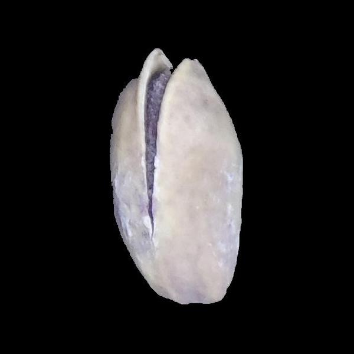
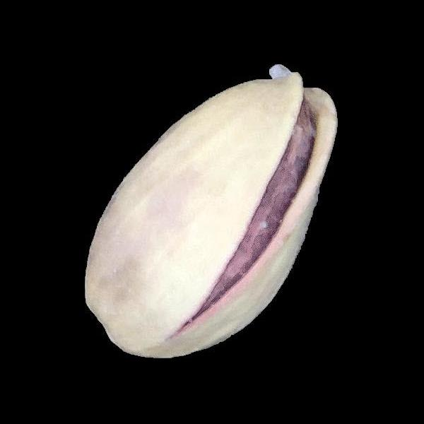
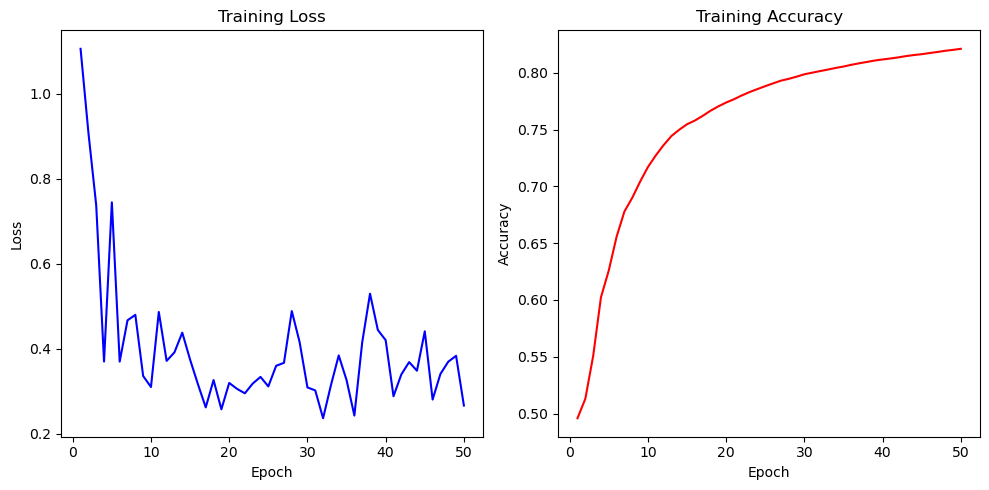

## Table of Contents

- [Table of Contents](#table-of-contents)
- [Image Classification](#image-classification)
  - [What is Image Classification?](#what-is-image-classification)
- [Presentation of the Task](#presentation-of-the-task)
- [Necessary Packages](#necessary-packages)
- [Architecture of model](#architecture-of-model)
- [Results](#results)
  - [Accuracy and Loss Plot](#accuracy-and-loss-plot)
  - [Test Accuracy](#test-accuracy)
## Image Classification

### What is Image Classification?

Image classification is a type of AI where computers are trained to analyze and categorize images by assigning labels like "cat" or "dog" to the entire picture. This uses machine learning algorithms trained on a lot of labeled data to get better at recognizing patterns and becomes useful in everything from self-driving cars to medical diagnosis.

## Presentation of the Task

In this project, we tackle a classification problem using advanced Convolutional Neural Networks (CNN) and the Pistachio Image dataset. 
This dataset consists of two classes: 

Kirmizi pistachio:


Siirt Pistachio:


## Necessary Packages
```
opencv-python
torch
sklearn
matplotlib
```
## Architecture of model
```
  (conv1): Conv2d(3, 64, kernel_size=(2, 2), stride=(2, 2))
  (maxpool): MaxPool2d(kernel_size=2, stride=2, padding=0, dilation=1, ceil_mode=False)
  (activation): ReLU()
  (flatten): Flatten(start_dim=1, end_dim=-1)
  (dropout): Dropout(p=0.5, inplace=False)
  (linear): Linear(in_features=160000, out_features=2, bias=True)
```
## Results 

### Accuracy and Loss Plot


### Test Accuracy
```
Test Accuracy : 83.95%
```